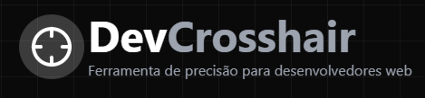

# DevCrosshair



## Sobre o Projeto

DevCrosshair é uma ferramenta de precisão para desenvolvedores web que facilita a medição, inspeção e análise de elementos em páginas web. Projetada para ser leve, não-intrusiva e fácil de usar, o DevCrosshair pode ser carregado em qualquer site através do console do navegador.

## Funcionalidades

- **Crosshair de Precisão**: Linhas guias vertical e horizontal que seguem o cursor
- **Coordenadas em Tempo Real**: Exibição das coordenadas X e Y do cursor
- **Inspeção de Elementos**: Informações detalhadas sobre o elemento sob o cursor
- **Informações de Fonte**: Detalhes sobre as propriedades de texto do elemento
- **Modo de Medição**: Medir distâncias entre dois pontos na página
- **Grade de Referência**: Sobreposição de grade para alinhamento
- **Atalhos de Teclado**: Controles rápidos para todas as funcionalidades
- **Copiar Informações**: Copiar para a área de transferência com um clique

## Como Usar

1. Copie o script de carregamento
2. Abra o console do navegador (F12 ou Ctrl+Shift+J)
3. Cole o script no console e pressione Enter
4. O DevCrosshair será carregado automaticamente

```javascript
(function () {
  const script = document.createElement("script");
  script.src = "https://seu-dominio.vercel.app/api/devcrosshair";
  document.body.appendChild(script);
})();
```
